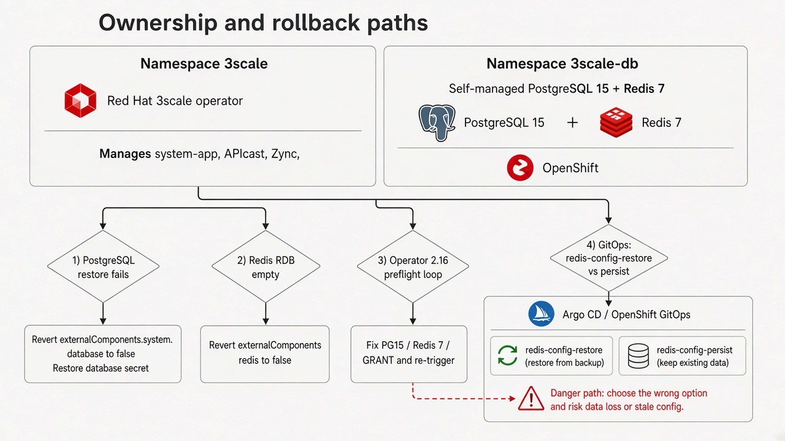

# Rollback

Usar esta página cuando el cutover falla **antes** de borrar Deployments y PVC embebidos, o cuando el upgrade del operador 3scale 2.16 entra en bucle de preflight. Copia para clonar el repo: `docs/runbooks/07-rollback.md` (inglés: `docs/runbooks/en/07-rollback.md`).

Si los recursos embebidos ya no existen, el rollback implica **restaurar desde backup** (snapshot de PVC, `pg_dump`, `dump.rdb`), no volver `externalComponents` a pods embebidos que ya no están.

## Quién opera qué

| Namespace | Gestiona el operador | Gestionás vos |
|-----------|----------------------|---------------|
| `3scale` | `system-app`, APIcast, Zync, `zync-database`, `system-storage` | Secrets de conexión (`system-database`, `system-redis`, `backend-redis`) |
| `3scale-db` | Nada del operador 3scale tras `externalComponents` | PostgreSQL 15, ambos Redis 7, PVC, imágenes, backups, NetworkPolicy |

Ver [Motivación](why.es.md) para *external ≠ off-cluster* y qué deja de reconciliar el operador.

## Falla el restore de PostgreSQL

1. Volver `externalComponents.system.database` a `false` en el APIManager.
2. Reaplicar PostgreSQL embebido en el spec del APIManager si hace falta: `spec.system.database.postgresql: {}`.
3. Restaurar el secret `system-database` desde el backup (`system-database-secret.yaml`).
4. Subir el operador 3scale y `system-postgresql` embebido.
5. Validar Admin Portal y APIs contra los datos embebidos.
6. **No** borrar el PVC nuevo de PostgreSQL en `3scale-db` hasta confirmar el embebido.

## RDB de Redis vacío o falla el restore

1. Volver `externalComponents.system.redis` y `externalComponents.backend.redis` a `false`.
2. Restaurar secrets `system-redis` y `backend-redis` desde backup.
3. Subir `backend-redis` y `system-redis` embebidos en 3scale 2.15.
4. Validar portales y tráfico de API.
5. **No** borrar los PVC nuevos de Redis en `3scale-db` hasta confirmar el embebido.

Si `dump.rdb` quedó vacío en Git Bash, usar `docs/runbooks/02-bis-externalize-redis-windows.md` (`MSYS_NO_PATHCONV=1`, `oc exec` + `cat`) y repetir [Externalizar Redis](externalize-redis.es.md).

## Bucle de preflight del operador 3scale 2.16

Síntomas: el operador 2.16 se instala pero el upgrade de instancia no completa; los chequeos de versión fallan cada ~10 minutos.

1. Confirmar PostgreSQL ≥ 15.0 y Redis ≥ 7.2 en los pods externos ([Actualizar operador a 2.16](upgrade-216.es.md#ejecutar-comprobaciones-de-preflight)).
2. Aplicar el GRANT de PostgreSQL 15 si `system-app-pre` reporta `permission denied for schema public` — ver [GRANT CREATE en schema `public`](externalize-postgresql.es.md#grant-create-en-schema-public).
3. Borrar el Job `system-app-pre` y dejar que el operador lo recree.
4. **No** combinar upgrade de OpenShift y de 3scale en la misma ventana.
5. Si las versiones no se pueden corregir a tiempo, quedarse en canal `threescale-2.15` hasta cumplir preflight.

## Trampa GitOps (Redis)

Si Argo CD o RHACM sigue con `redis-config.path` en `kustomize/bases/redis-config-restore`, `selfHeal: true` revierte el modo persistencia tras el cutover. Un restart del pod puede **borrar datos de Redis**. Pasar a `redis-config-persist` antes de dar por cerrada la migración. Ver [Trampas de GitOps](gitops.es.md#trampas-de-gitops) y [Operación día 2](day-2.es.md).

## Próximos pasos

- [Secuencia de migración](sequence.es.md)
- [Operación día 2](day-2.es.md)
- [FAQ de operación](faq.es.md)
