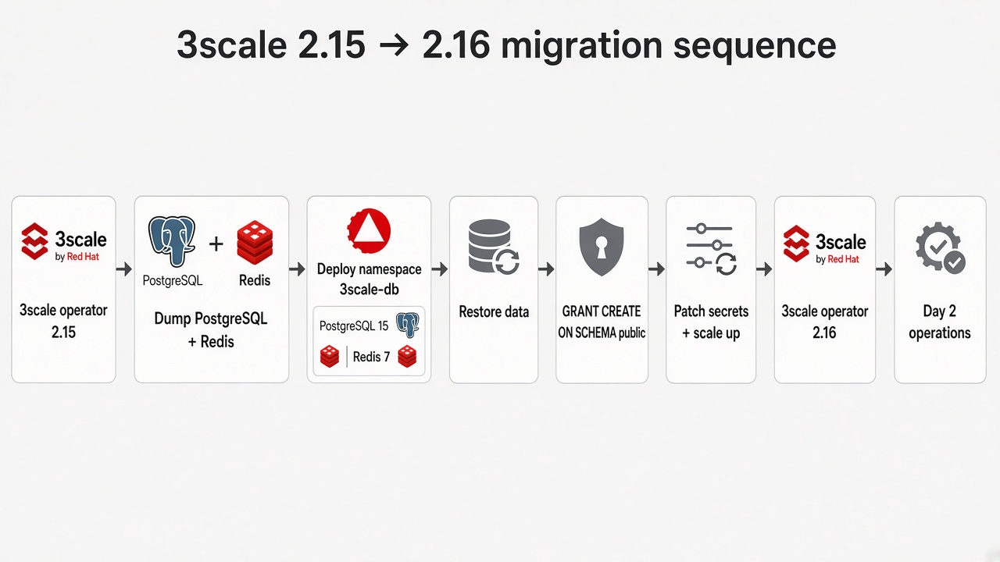
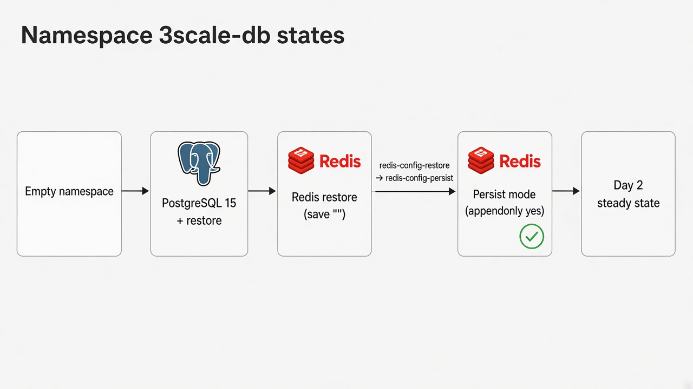

# Secuencia de migración

El valor por defecto es Linux/bash. Esta página se alinea con `docs/runbooks/00-secuencia-y-matriz.md` del repositorio.

Completar [Requisitos previos](prerequisites.es.md) antes del paso 1.

## Orden de operaciones


*Diagrama en inglés — fases: operador 2.15 → dump → `3scale-db` → restore → GRANT → secrets → operador 2.16 → día 2.*


*Diagrama en inglés — vacío → restore PG → restore Redis (`save ""`) → persist (`appendonly yes`) → día 2.*

1. **Instalar 3scale 2.15** en un cluster de prueba — operador 3scale + APIManager con bases embebidas ([Instalar 3scale 2.15 (lab)](install-lab.es.md)).
2. **Confirmar la matriz**: versión de OpenShift soportada por 2.15 **y** 2.16; último CSV en el canal `threescale-2.15`.
3. **Instantánea / backup** de PVC y secrets (`system-database`, `system-redis`, `backend-redis`).
4. **Abrir una ventana de mantenimiento**: escalar a 0 el operador 3scale y los componentes **excepto** la base que se está volcando.
5. **Externalizar PostgreSQL** 10 → 15 in-cluster ([Externalizar PostgreSQL](externalize-postgresql.es.md)).
6. **Externalizar Redis** 6 → 7 in-cluster ([Externalizar Redis](externalize-redis.es.md)).
7. Marcar `spec.externalComponents` en el APIManager (los runbooks de PostgreSQL y Redis lo hacen).
8. **Restaurar réplicas**. Validar Admin Portal, Developer Portal y APIcast.
9. **Actualizar el operador 3scale** al canal `threescale-2.16` ([Actualizar operador a 2.16](upgrade-216.es.md)).
10. **Actualizar OpenShift** después, si aplica, según [Supported Configurations](https://access.redhat.com/articles/2798521).
11. **Operar el día 2** en `3scale-db`: Redis persistente, backups, digest anclado ([Operación día 2](day-2.es.md)).

Si un paso falla antes de borrar recursos embebidos, ver [Rollback](rollback.es.md).

!!! warning "No combinar upgrades"
    No ejecutar el upgrade de 3scale y el de OpenShift en la misma ventana de mantenimiento.

## Overlays de laboratorio vs producción

| Overlay | StorageClass | Uso |
|---------|--------------|-----|
| `lab` / `lab-persist` | `gp3-csi` (ejemplo) | Clusters de prueba |
| `prod` / `prod-persist` | Por defecto del cluster | Entornos tipo producción |

El procedimiento 3scale es el mismo. Solo cambian los valores por defecto de almacenamiento.

## Opciones de despliegue

=== "GitOps (recomendado)"

    ```bash
    # Fase 1: operador 3scale 2.15 + APIManager
    oc apply -k gitops/
    oc apply -k gitops/rhacm/              # managed cluster vía hub ACM

    # Fase 2: bases in-cluster (crear antes el secret system-database en 3scale-db)
    oc apply -k gitops/external-db
    oc apply -k gitops/rhacm/external-db
    ```

=== "Kustomize (sin Argo CD)"

    ```bash
    oc apply -k kustomize/overlays/lab-operator
    oc apply -k kustomize/overlays/lab-efs
    oc apply -k kustomize/overlays/lab-apimanager
    # tras dump/restore:
    oc apply -k kustomize/overlays/lab
    ```

Ver [GitOps y RHACM](gitops.es.md) para el orden por waves y Placement de RHACM.
